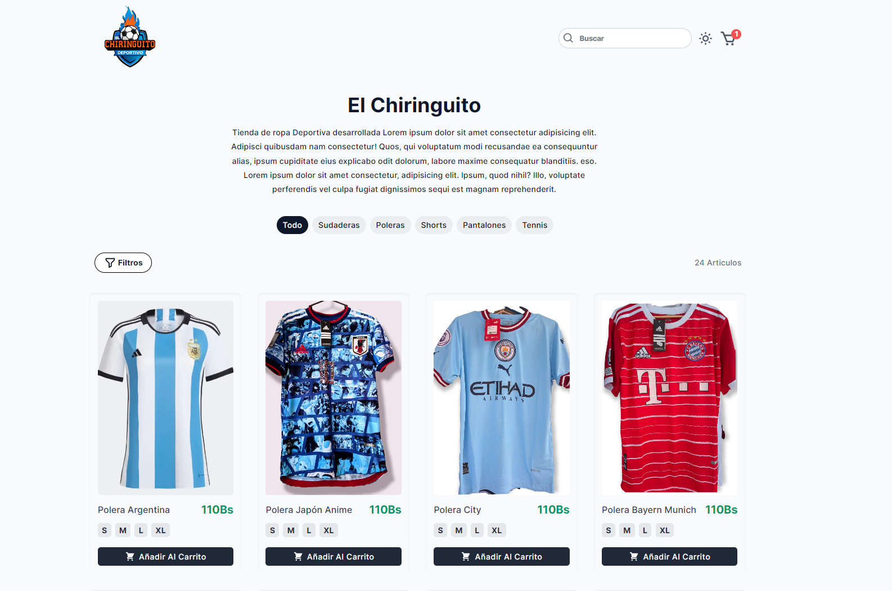

# E-Commerce Sportswear

## Table of contents

- [Preview](#preview)
  - [Links](#links)
- [How to use](#how-to-use)
- [My process](#my-process)
  - [Built with](#built-with)
  - [What I learned](#what-i-learned)
  - [Continued development](#continued-development)
  - [Useful resources](#useful-resources)
- [Author](#author)

## Preview



### Links

- API: [API](https://api-ecommerse.up.railway.app/products)
- Repository URL: [Repository](https://github.com/fabioalcocer/e-commerce-x)
- Live Site URL: [Live](https://e-commerce-x.vercel.app)

## How to use

### 1. Install dependencies

```
$ npm install
```

### 2. Use / build your own API

####  Make sure your API has this structure
  - API Docs URL: [https://github.com/Andres2310/API-ecommerse-x](https://github.com/Andres2310/API-ecommerse-x)
```json
{
  "id": 1,
  "name": "Hoodie Anime",
  "sizes": ["S","M","L","XL"],
  "category": "Sudaderas",
  "price": 180,
  "quantity": 1,
  "imageSrc": "https://res.cloudinary.com/image/hoddie_anime.webp"
}
```

### 3. Change the API URL

- Path File: './src/services/data.js'

```jsx
const API_URL = "https://my-api-url.com";
```

### 4. Replace "number" for your phone number

```html
<a
  href={`https://wa.me/<number>?text=${encodeURIComponent(string)}`}
>
  Whatsapp
</a>
```

## My process

### Built with

- Mobile-first workflow
- Responsive Design
- Grid Layout
- Tailwind CSS
- Flowbite
- Vite
- React v18
- Context API
- HeadlessUI

### Useful resources

- [Beta React Docs](https://beta.reactjs.org/)
- [HeadlessUI](https://headlessui.com/)
- [Gh-Pages](https://www.npmjs.com/package/gh-pages)
- [MDN Web Docs](https://developer.mozilla.org/es/docs/Web)
- [Flowbite](https://flowbite.com/docs/)
- [React Icons](https://react-icons.github.io/react-icons/)

##

## Author

### Fabio Alcocer Sejas

- GitHub - [@fabioalcocer](https://github.com/fabioalcocer/)
